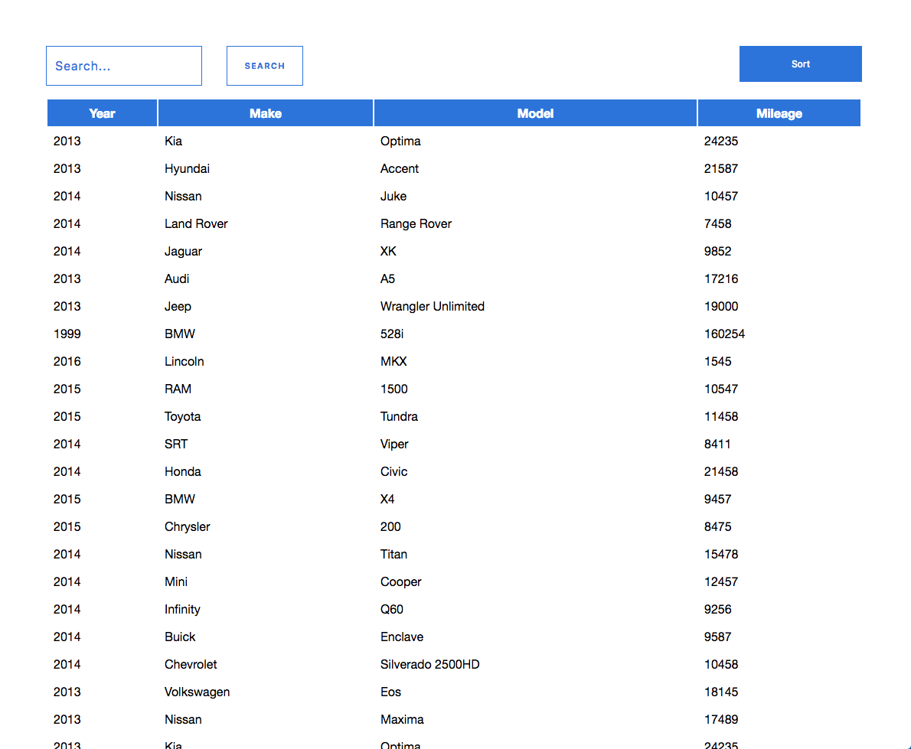
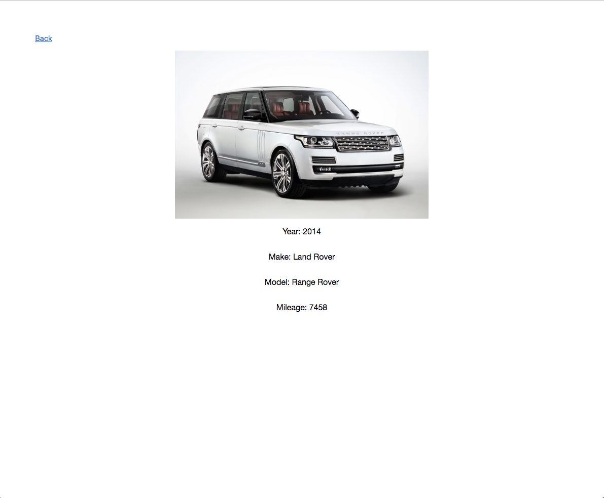

# Vehicle App

## Building the application

The application is built on React using the create-react-app library. The components are broken down into smart containers and dumb components in the src folder. 

## Running the app

1. ``` npm install ```

2. ``` npm run build ```

3. ``` npm run start```

You should be able to access it at localhost:3000.

If you want to run tests, run `npm run test` and you can build the scss by running `npm run build-css` and you can watch the scss by running `npm run watch-css`.

## Application details

The application lists a set of vehicles from a JSON endpoint. The user can sort the list by mileage, year and listing date. A user can also search for a specific car with the search input. A user can look at more details about a car by clicking on it. 




